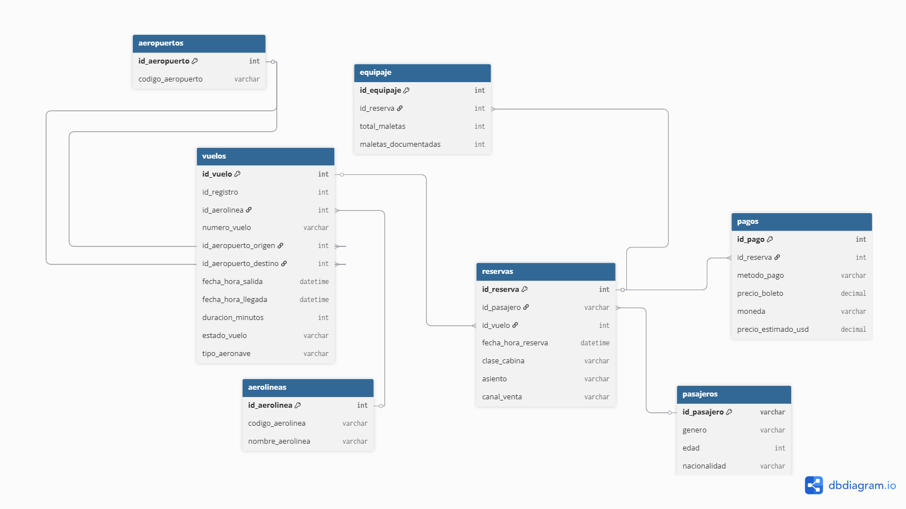

# Documentación Técnica — Modelo Relacional OLTP
## Sistema de Gestión de Vuelos y Reservas
**Base de datos:** `Practica1_semi2`  
**Motor:** Microsoft SQL Server 16.0  
**Fecha:** Febrero 2026

---

## 1. Descripción General del Proyecto

Este proyecto consiste en el diseño e implementación de una base de datos relacional (OLTP) para el almacenamiento y gestión de información de vuelos, pasajeros, reservas, pagos y equipaje, a partir de un dataset crudo en formato CSV (`dataset_vuelos_crudo.csv`).

El proceso involucra tres etapas principales:

1. **Limpieza y transformación** de los datos crudos usando Python y pandas.
2. **Carga (ETL)** de los datos limpios hacia SQL Server mediante `pyodbc`.
3. **Almacenamiento estructurado** en un modelo relacional normalizado.

El dataset contiene información de vuelos de múltiples aerolíneas con rutas entre aeropuertos de América Latina, América del Norte y Europa, incluyendo datos de pasajeros, reservas, métodos de pago y equipaje.

---

## 2. Diagrama del Modelo Relacional

### Tablas y Relaciones



### Descripción de Tablas

| Tabla | Descripción | PK |
|---|---|---|
| `aerolineas` | Catálogo de aerolíneas operadoras | `id_aerolinea` (INT IDENTITY) |
| `aeropuertos` | Catálogo de aeropuertos por código IATA | `id_aeropuerto` (INT IDENTITY) |
| `pasajeros` | Datos demográficos del pasajero | `id_pasajero` (VARCHAR 50 - UUID) |
| `vuelos` | Información operacional de cada vuelo | `id_vuelo` (INT IDENTITY) |
| `reservas` | Relación pasajero-vuelo con detalles de reserva | `id_reserva` (INT IDENTITY) |
| `pagos` | Información de pago por reserva | `id_pago` (INT IDENTITY) |
| `equipaje` | Detalle de maletas por reserva | `id_equipaje` (INT IDENTITY) |

---

## 3. Explicación del ETL Paso a Paso

El proceso ETL se implementó en Python y se divide en dos fases: **transformación** y **carga**.

### Fase 1 — Extracción y Transformación (pandas)

**3.1 Carga del CSV**
```python
df = pd.read_csv('dataset_vuelos_crudo.csv')
```

**3.2 Eliminación de registros nulos críticos**

Se eliminan filas donde los campos obligatorios están vacíos:
```python
df.dropna(subset=["passenger_nationality"], inplace=True)
df.dropna(subset=["seat"], inplace=True)
df.dropna(subset=["passenger_id"], inplace=True)
df.dropna(subset=["origin_airport", "destination_airport"], inplace=True)
```

**3.3 Normalización del género**

Se estandarizan múltiples variantes al formato `M`, `F` o `X`:
```python
df["passenger_gender"] = df["passenger_gender"].replace({
    "Masculino": "M", "masculino": "M", "m": "M",
    "Femenino": "F",  "femenino": "F",  "f": "F",
    "X": "X", "x": "X"
})
```

**3.4 Imputación de valores nulos**

- `passenger_age`: se rellena con la **mediana** de la columna.
- `sales_channel`: se rellena con la **moda** (valor más frecuente).

**3.5 Limpieza del precio**

Se normaliza el separador decimal (coma → punto) y se convierte a numérico:
```python
df["ticket_price"] = df["ticket_price"].str.replace(",", ".", regex=False)
df["ticket_price"] = pd.to_numeric(df["ticket_price"], errors="coerce").round(2)
```

**3.6 Conversión de fechas**
```python
df["departure_datetime"] = pd.to_datetime(df["departure_datetime"],
    format="mixed", dayfirst=True, errors="coerce")
```
Se aplica el mismo tratamiento a `arrival_datetime` y `booking_datetime`.

**3.7 Normalización de códigos**
```python
df["airline_code"]        = df["airline_code"].str.strip().str.upper()
df["origin_airport"]      = df["origin_airport"].str.strip().str.upper()
df["destination_airport"] = df["destination_airport"].str.strip().str.upper()
```

---

### Fase 2 — Carga a SQL Server (pyodbc)

El orden de carga respeta las dependencias de llaves foráneas:

```
1. aerolineas
2. aeropuertos
3. pasajeros
4. vuelos        (depende de aerolineas y aeropuertos)
5. reservas      (depende de pasajeros y vuelos)
6. pagos         (depende de reservas)
7. equipaje      (depende de reservas)
```

**3.8 Construcción de mapas de IDs**

Después de insertar las tablas catálogo, se construyen diccionarios para relacionar códigos con IDs generados por `IDENTITY`:

```python
cursor.execute("SELECT id_aerolinea, codigo_aerolinea FROM aerolineas")
aerolinea_map = {row[1]: row[0] for row in cursor.fetchall()}

cursor.execute("SELECT id_aeropuerto, codigo_aeropuerto FROM aeropuertos")
aeropuerto_map = {row[1]: row[0] for row in cursor.fetchall()}
```

**3.9 Captura del ID generado en vuelos**

Se usa `OUTPUT INSERTED.id_vuelo` para obtener el ID autogenerado y construir el mapa de vuelos:

```python
vuelo_map = {}
cursor.execute("""
    INSERT INTO vuelos (...) OUTPUT INSERTED.id_vuelo VALUES (?,?,...)
""", ...)
id_vuelo = cursor.fetchone()[0]
vuelo_map[int(r["record_id"])] = id_vuelo
```

---

## 4. Decisiones de Diseño

**4.1 UUID como PK en pasajeros**

Se decidió usar el `passenger_id` del CSV (formato UUID) directamente como llave primaria de la tabla `pasajeros` en lugar de un `INT IDENTITY`. Esto evita la necesidad de un mapa adicional y garantiza que el mismo pasajero no se duplique entre ejecuciones del ETL.

**4.2 Tablas catálogo para aerolíneas y aeropuertos**

En lugar de almacenar el código de aerolínea o aeropuerto directamente en `vuelos`, se crearon tablas catálogo independientes (`aerolineas`, `aeropuertos`). Esto normaliza los datos, evita redundancia y facilita futuras actualizaciones de nombres.

**4.3 Separación de pagos y equipaje**

Aunque `pagos` y `equipaje` podrían haberse incluido como columnas en `reservas`, se mantienen como tablas independientes para respetar la **Primera Forma Normal** y permitir escenarios donde una reserva pueda tener múltiples registros de pago o equipaje en el futuro.

**4.4 Commit separado por etapa**

Se realiza un `commit()` explícito después de cada grupo de inserciones (catálogos, vuelos, reservas) para garantizar que los datos estén disponibles para los mapas y evitar errores de transacciones abiertas.

---

